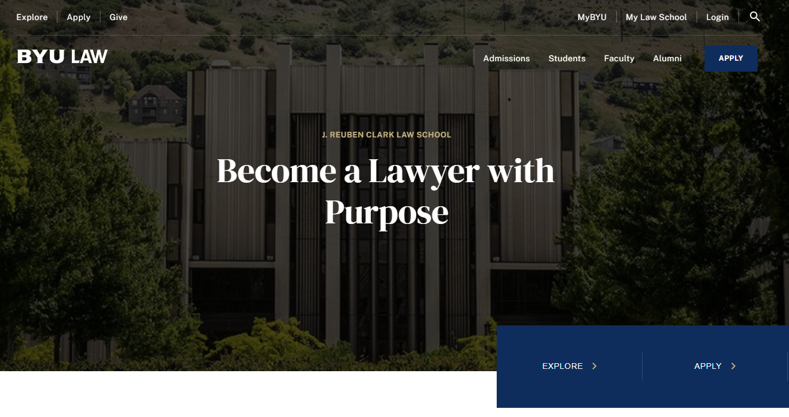
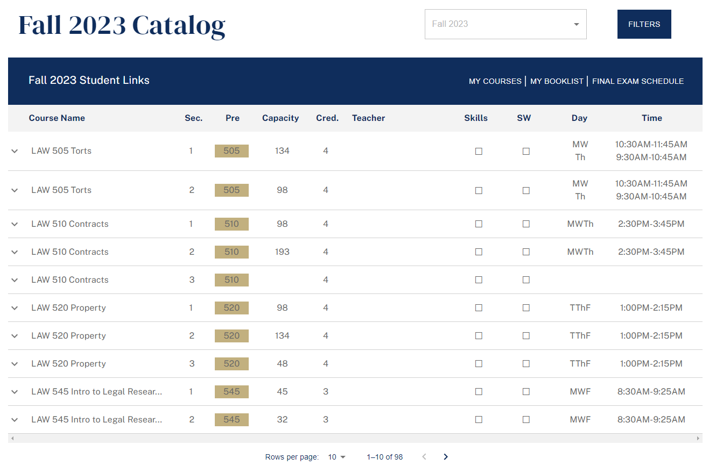
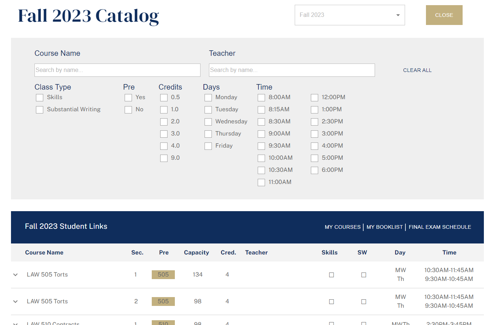
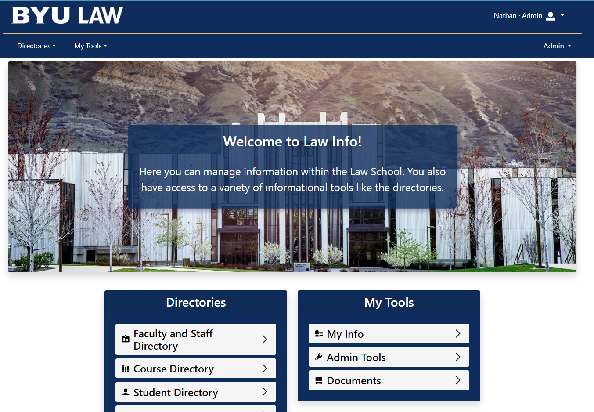

# Welcome to Cypress.io

Test modern apps directly in your browser

<div class="pt-8">
  
</div>

<div class="abs-br m-6 flex gap-2">
  <button @click="$slidev.nav.openInEditor()" title="Open in Editor" class="text-xl slidev-icon-btn opacity-50 !border-none !hover:text-white">
    <carbon:edit />
  </button>
  <a href="https://www.cypress.io/app/#browser_testing" target="_blank" alt="Cypress"
    class="text-xl slidev-icon-btn opacity-50 !border-none !hover:text-white">
    <carbon-logo-github />
  </a>
</div>

<!--
The last comment block of each slide will be treated as slide notes. It will be visible and editable in Presenter Mode along with the slide. [Read more in the docs](https://sli.dev/guide/syntax.html#notes)
-->

---

# What is Cypress?

With Cypress, you can easily create tests for your modern web applications, debug them visually, and automatically run them in your continuous integration builds.

- 🖥️ **Browser-based** - the tests run directly in the browser
- 🛠 **Debuggable** - use your normal browser dev tools to debug failed tests
- 🖱️ **Interactive** - tests interact with the application just like a user would
- ⚡ **Fast** - runs as fast as your browser can render content
- 🧑‍💻 **Developer Friendly** - simple syntax, easy to learn and use
- 🎥 **Recording** - all tests are recorded and can be viewed anytime

<br>
<br>

Read more about [Why Cypress?](https://www.cypress.io/app/)

<!--
You can have `style` tag in markdown to override the style for the current page.
Learn more: https://sli.dev/guide/syntax#embedded-styles
-->


<!--
Here is another comment.
-->

---
layout: default
---

<div grid="~ cols-2 gap-4">
<div>

<h1>Implementation</h1>

Testing Home and Landing Pages

```js {all|2-4|7|8|all}
describe('dev law 23 site', () => {
  beforeEach(() => {
    cy.visit('https://23.byulaw-dev.org')
  })

  it('loads home page and landing pages correctly', () => {
    cy.contains('Explore').click()
    cy.contains('Apply').click()
    cy.contains('Give').click()
    cy.contains('Students').click()
    cy.contains('Admissions').click()
    cy.contains('Learn More').click()
    cy.contains('Faculty').click()
    cy.contains('Alumni').click()
    cy.contains('Apply')
  })
})
```

</div>
<div>



</div>
</div>


---
layout: default
clicks:
transition: fade-out
---

# More advanced

<div grid="~ cols-2 gap-4">
<div>

```js {all|2}
it('filters by course name', () => {
  cy.get('@filters').click()
  cy.get('[data-cy="course-name"]').as('input').click().type('intro')
  cy.get('[data-cy="title"]').as('titles').each(($el) => {
    cy.wrap($el).contains('intro', {matchCase: false})
  })
  cy.get('@input').click().clear().type('Milestones')
  cy.get('@titles').each(($el) => {
    cy.wrap($el).contains('Milestones', {matchCase: false})
  })
  cy.get('@input').click().clear().type('m')
  cy.get('@titles').each(($el) => {
    cy.wrap($el).contains('m', {matchCase: false})
  })
  cy.get('[data-cy="clear-button"]').click()
  cy.get('@input').should('not.contain', 'm')
})
```

</div>
<div>



</div>
</div>


---
layout: default
clicks: 2
---

# More advanced

<div grid="~ cols-2 gap-4">
<div>

```js {3|4-6|all}
it('filters by course name', () => {
  cy.get('@filters').click()
  cy.get('[data-cy="course-name"]').as('input').click().type('intro')
  cy.get('[data-cy="title"]').as('titles').each(($el) => {
    cy.wrap($el).contains('intro', {matchCase: false})
  })
  cy.get('@input').click().clear().type('Milestones')
  cy.get('@titles').each(($el) => {
    cy.wrap($el).contains('Milestones', {matchCase: false})
  })
  cy.get('@input').click().clear().type('m')
  cy.get('@titles').each(($el) => {
    cy.wrap($el).contains('m', {matchCase: false})
  })
  cy.get('[data-cy="clear-button"]').click()
  cy.get('@input').should('not.contain', 'm')
})
```

</div>
<div>





</div>
</div>


---

# Why We Should Use It

<div grid="~ cols-2 gap-4">
<div>

Catches bugs before they become an issue.

As our apps grow, it becomes more unreasonable to physically test all functionality on the site after making changes.

Easy to maintain neglected functionality.

Check out [Cypress.io](https://www.cypress.io/app) for more.

</div>
<div>



</div>
</div>
